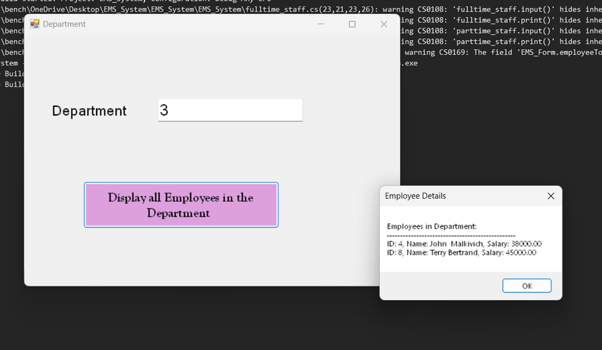

## Project Title
Employee Management System (EMS)

## Brief Description
This is an Employee Management System, a desktop application created in early 2025. The objective of this project is to enhance the process by which the Human Resources department manages employee data by transitioning from manual processes to a user-friendly and easy to use system.

## Objective of the Project :) 
This application has been created to: 
 - Digitally record and oversee employee information
 - Allocate employees to specific departments
 - Facilitate quick updates and searches
 - Produce real-time reports based on department data

## Built with
- **C# (.NET Framework)**
- **Windows Forms (WinForms)**
- **Microsoft SQL Server (LocalDB)**
- **Visual Studio**

## Key Features
- Main Menu
-  Add, view, update, and delete employees
-  Assign employees to departments
- Search for employee by ID
-   View employees by department
-   Generate reports:
- **Department Salary Report**
- **Gender Ratio Report**

## Database Design
### `Department` Table
- `DepartmentID`
- `DepartmentName`
### `Employee` Table
- `EmployeeID`
- `FirstName`, `LastName`
- `DateOfBirth`, `PhoneNumber`, `Address`
- `DepartmentID`
- `Salary`, `Gender`

## Database Design

### Department Table  

### Designing Department Table

### Inserting Data into Tables

## Application Preview

### Main Menu  

### Add Employee  

### Delete Employee  

### View Employee Details by ID  

### Filter by Department  

### Generate Reports  

## What I learned?
This project helped me:
- Practice SQL and relational database design
- Build CRUD functionality in C#
- Connect forms to a real database
- Design a clean and functional UI
- Handle user inputs and validations

## About me
I’m in the process of enhancing my skills in software development, and this is a full-stack applications I created from the ground up. I have a strong enthusiasm for developing solutions that address practical challenges, and I'm constantly seeking to expand my knowledge.

Feel free to take a look at my project! 😊
